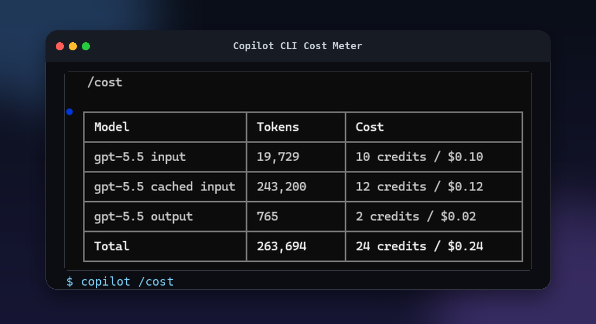
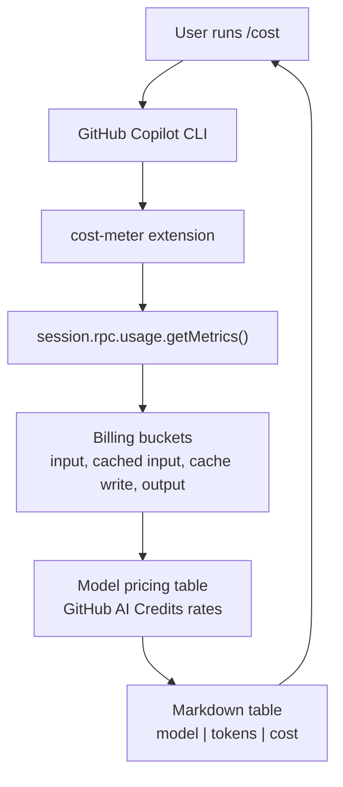

# Copilot CLI Cost Meter

A small GitHub Copilot CLI extension that adds `/cost`, a read-only estimate of current session token billing using GitHub Copilot AI Credits model pricing.

> [!IMPORTANT]
> This is a personal, best-effort estimate from local Copilot CLI session metrics. Do not treat it as authoritative billing data; always use the official GitHub billing pages for your account or organization as the source of truth.

<p align="center">
  
</p>

It intentionally keeps the output minimal: model, token bucket, and estimated AI Credit spend.

Pricing source: <https://docs.github.com/en/copilot/reference/copilot-billing/models-and-pricing>

## Architecture



## How robust is it?

This is deliberately simple: one extension file, no runtime dependencies, no network calls, no secrets, and no filesystem writes during use. It reads the Copilot CLI session's own usage metrics through the extension SDK and formats a billing estimate.

The main maintenance point is the hardcoded pricing table. If GitHub changes model names or rates, update `extension/extension.mjs` from the official pricing page and reinstall.

## Install

Clone the repo, then run the installer for your shell.

```bash
git clone https://github.com/adstuart/copilot-cli-cost-meter.git
cd copilot-cli-cost-meter
```

### Windows PowerShell

```powershell
.\install.ps1
```

### macOS / Linux

```bash
./install.sh
```

Restart Copilot CLI after installation. If your Copilot CLI supports extension reloads in-session, you can reload instead of restarting.

## Use

In Copilot CLI:

```text
/cost
```

The command prints only a table:

```text
| Model | Tokens | Cost |
| --- | ---: | ---: |
| gpt-5.5 input | 19,729 | 10 credits / $0.10 |
| gpt-5.5 cached input | 243,200 | 12 credits / $0.12 |
| gpt-5.5 output | 765 | 2 credits / $0.02 |
| **Total** | **263,694** | **24 credits / $0.24** |
```

## Billing notes

- 1 AI Credit is treated as $0.01 USD.
- Cached input is not double-counted: full-rate input is calculated as `inputTokens - cacheReadTokens - cacheWriteTokens`.
- Reasoning tokens are not shown as a separate billing row; they are treated as part of output for this simplified view.
- This is an estimate. Exact GitHub billing may differ from local session metrics.

## Development

Check syntax:

```bash
npm run check
```
